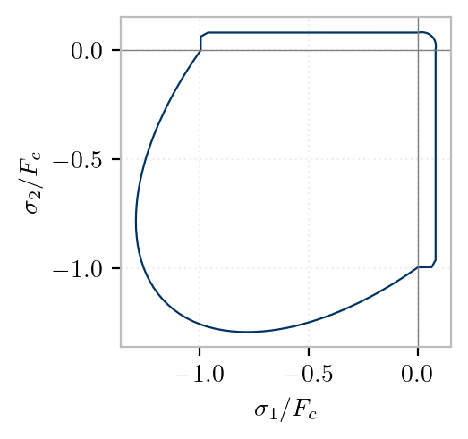

# FariaPlasticDamage



```{eval-rst}
.. py:method:: Model.nDMaterial("FariaPlasticDamage", tag, E, nu, Ft, Fc [, beta, Ap, An, Bn])
   :no-index:

   :param tag: unique integer tag for the material
   :type tag: |integer|
   :param E: Young's modulus
   :type E: |float|
   :param nu: Poisson ratio :math:`\nu`
   :type nu: |float|
   :param Ft: tensile strength :math:`F_t`
   :type Ft: |float|
   :param Fc: compressive strength :math:`F_c`
   :type Fc: |float|
   :param beta: parameter :math:`\beta` controlling plastic strain rate/post-yield hardening parameter
   :type beta: |float|
   :param Ap: parameter :math:`A_p` controlling tensile fracture energy
   :type Ap: |float|
   :param An: parameter :math:`A_n` controlling ductility of the compressive response
   :type An: |float|
   :param Bn: parameter :math:`B_n` controlling ductility and peak strength of the compressive response
   :type Bn: |float|

```

## Theory

This model is a 2-parameter damage-plasticity formulation based on the work of Faria et al. (1998).
The plastic strain evolution assumes that plastic strain evolves in the same direction as the elastic strain (Faria et al. 1998):

$$
\dot{\boldsymbol{\varepsilon}}_p = \beta \frac{E L}{\|\overline{\boldsymbol{\sigma}}\|}\left(\mathbb{C}_{\mathrm{e}}^{-1} \overline{\boldsymbol{\sigma}}\right)
$$

where $\beta$ is the plastic strain coefficient, $L$ is a scalar that depends on the effective stress tensor and the strain rate tensor, $\bar{\sigma}$ is the effective stress tensor, $E$ is the Young's modulus, and C is the elastic stiffness tensor.

The following exponential damage evolution rules are adopted to describe the dependence of the damage variables $d^{ \pm}$ on the equivalent stresses $r^{ \pm}$:

$$
\begin{aligned}
& d^{+}=1-\left(\frac{r_0^{+}}{r^{+}}\right) \exp \left[A_p\left(1-\frac{r^{+}}{r_0^{+}}\right)\right] \\
& d^{-}=1- {\frac{r_0^{-}}{r^{-}}}\left(1-A_n\right)-A_n \exp \left[B_n\left(1- {\frac{r^{-}}{r_0^{-}}}\right)\right]
\end{aligned}
$$
where $A_p, A_n$, and $B_n$ are damage parameters that describe the softening behavior of the stress-strain relation, as reported in *Faria et al. (1998)*.

Let

$$
\alpha \triangleq \frac{r^{-}_{0}}{r^{-}},\quad 
x = B_n\Bigl(1 - \frac{r^{-}}{r^{-}_{0}}\Bigr)
$$

Then the expression for $d^{-}$ can be rewritten as

$$
d^{-} = (1-\alpha)\,(1 - A_n)\;-\;A_n\bigl(\exp(x)-1\bigr)
$$

In this form:

* $(1-\alpha)$ is often small but computed in one go.
* $\mathrm{expm1}(x)$ accurately gives $\exp(x)-1$ even when $x\approx 0$.


When $\displaystyle r^{+} \approx r^{+}_{0}$, directly computing

$$
d^{+} = 1  - (r^{+}_{0}/r^{+})   \exp\!\bigl(A_p (1 - r^{+}/r^{+}_{0})\bigr);
$$

will suffer cancellation. Introduce:

$$
\alpha \triangleq \frac{r^{+}_{0}}{r^{+}}, 
\quad
x = A_p\Bigl(1 - \frac{r^{+}}{r^{+}_{0}}\Bigr)
   = A_p\Bigl(1 - \frac1\alpha\Bigr).
$$

Rewrite

$$
d^{+} = 1 - \alpha\, \exp{x}
      = \bigl(1-\alpha\bigr)\;-\;\alpha\,(\exp{x}-1)
$$

* `std::expm1(x)` for $\exp{x} - 1$ when $|x|\ll1$.
* `std::fma(a,b,c)` for $a\cdot b + c$ in one rounding step.


## Examples

The properties of confined concrete were used for the boundaries, and those of unconfined concrete for the web (with $F_c= 45 \mathrm{Mpa}$ and $E_c=36,900 \mathrm{MPa}$). 
For unconfined concrete the following material parameters were adopted: $E_c=36,900 \mathrm{Mpa}, \nu=0.2$ $F_c=25.6$ МPa, $F_t=5 \mathrm{Mpa}, B_n=0.75, \beta=0.5, A_n=5, A_p=0.1$.
For confined concrete $F_t$ and $\beta$ were kept the same and the remaining parameters were modified as follows: $F_c=28 \mathrm{Mpa}, B_n=0.7$, $A_n=3, A_p=0.05$. 


## References

- R. Faria, J. Oliver, M. Cervera "A Strain-Based Plastic Viscous-Damage Model for Massive Concrete Structures". Int. J. Solids Structures 1998;35(14):1533–58. [doi: 10.1016/S0020-7683(97)00119-4](https://doi.org/10.1016/S0020-7683(97)00119-4)
- F Petrone, F McKenna, T Do, D McCallen  "A versatile numerical model for the nonlinear analysis of squat-to-tall reinforced-concrete shear walls" Engineering Structures, 2021 [doi: 10.1016/j.engstruct.2021.112406](https://doi.org/10.1016/j.engstruct.2021.112406)

