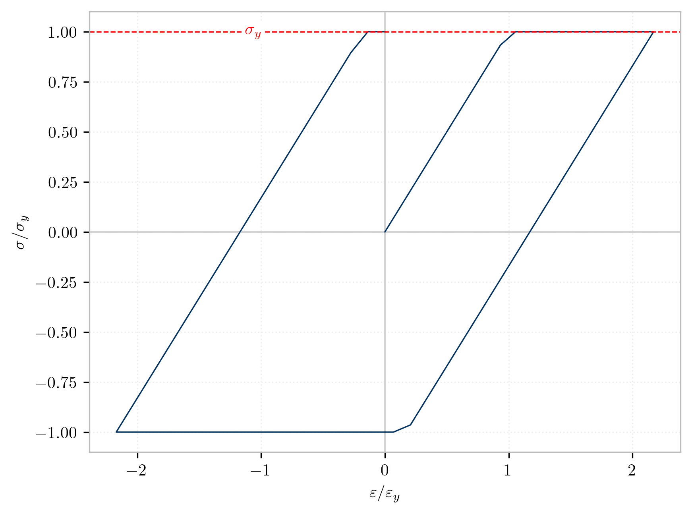

.. _steel01:

Steel01
^^^^^^^

This model implements a uniaxial bilinear steel material object with kinematic hardening and optional isotropic hardening described by a non-linear evolution equation (REF: Fedeas).

.. tabs::

   .. tab:: Python 

      .. py:method:: Model.uniaxialMaterial("Steel01", tag, Fy, E, b, [a1, a2, a3, a4])
         :no-index:

         :param int tag: integer tag identifying material
         :param |float| Fy: yield strength
         :param |float| E: initial elastic tangent
         :param |float| b: strain-hardening ratio (ratio between post-yield tangent and initial elastic tangent)
         :param |float| a1: optional: isotropic hardening parameter: increase of compression yield envelope as proportion of yield strength after a plastic strain of ``a2*(fy/E0)``.
         :param |float| a2: optional: isotropic hardening parameter (see explanation under ``a1``)
         :param |float| a3: optional: isotropic hardening parameter: increase of tension yield envelope as proportion of yield strength after a plastic strain of ``a4*(Fy/E0)``
         :param float a4: optional: isotropic hardening parameter (see explanation under ``a3``)

   .. tab:: Tcl

      .. function:: uniaxialMaterial Steel01 $tag $Fy $E $b <$a1 $a2 $a3 $a4>

      .. csv-table:: 
         :header: "Argument", "Type", "Description"
         :widths: 10, 10, 40

         $tag, |integer|, integer tag identifying material
         $Fy, |float|, yield strength
         $E, |float|, initial elastic tangent
         $b, |float|, strain-hardening ratio (ratio between post-yield tangent and initial elastic tangent)
         $a1, |float|, optional: isotropic hardening parameter: increase of compression yield envelope as proportion of yield strength after a plastic strain of $a2*($Fy/E0).
         $a2, |float|, optional:isotropic hardening parameter (see explanation under ``a1``)
         $a3, |float|, optional: isotropic hardening parameter: increase of tension yield envelope as proportion of yield strength after a plastic strain of $a4*($Fy/E0)
         $a4, |float|, optional: isotropic hardening parameter (see explanation under ``a3``)

	Steel01 behaviour under cyclic loading.

Examples
--------

The following example defines a *Steel01* material with the tag **1**, a yield strength of **60** and an initial Young's modulus of **29,000**.

.. tabs::

   .. tab:: Tcl

      .. code-block:: tcl
         
         model BasicBuilder -ndm 3
         uniaxialMaterial Steel01 60.0 20e3

   .. tab:: Python

      .. code-block:: python
         
         import xara 
         model = xara.Model(ndm=3)
         model.uniaxialMaterial("Steel01", 60.0, 29e3)

Code Developed by: |fcf|, |mhs|, |cmp|

