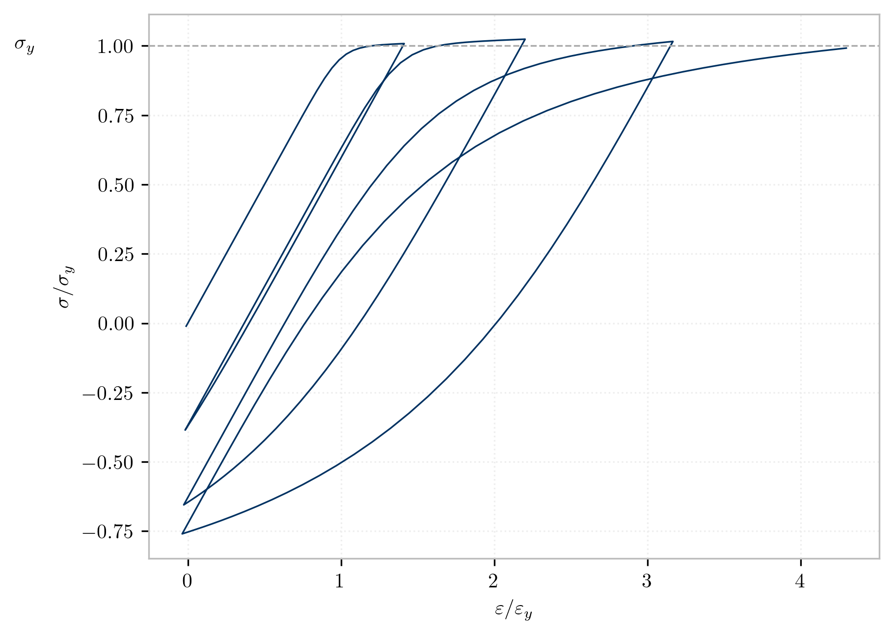

.. _steel02:

Steel02
^^^^^^^

*Steel02* is a uniaxial material based on the Giuffre-Menegotto-Pinto formulation with added isotropic strain hardening by [FilippouEtAl1983]_.

.. tabs::
   
   .. tab:: Python 

      .. py:method:: Model.uniaxialMaterial("Steel02", tag, Fy, E, b, R0, cR1, cR2, [a1, a2, a3, a4, sigInit])
         :no-index:
         :single-line-parameter-list:

         Add a *Steel02* material to *model* identified by *tag*.

         :param int tag: integer tag identifying material
         :param float Fy: yield stress, :math:`F_y` [1]_
         :param float E: initial elastic tangent, :math:`E` [1]_
         :param float b: strain-hardening ratio, :math:`b`
         :param float R0: parameter to control the transition from elastic to plastic branches, :math:`R_0`
         :param float cR1: parameter to control the transition from elastic to plastic branches, :math:`cR1`
         :param float cR2: parameter to control the transition from elastic to plastic branches, :math:`cR2`
         :param float a1: isotropic hardening parameter (optional: default = 0.0).
         :param float a2: isotropic hardening parameter (optional: default = 1.0).
         :param float a3: isotropic hardening parameter (optional: default = 0.0).
         :param float a4: isotropic hardening parameter (optional: default = 1.0).
         :param float sigInit: Initial Stress Value (optional: default = 0.0)

   .. tab:: Tcl

      .. function:: uniaxialMaterial Steel02 $tag $Fy $E $b $R0 $cR1 $cR2 <$a1 $a2 $a3 $a4 $sigInit>

      .. csv-table:: 
         :header: "Argument", "Type", "Description"
         :widths: 10, 10, 40

         tag, |integer|,	    integer tag identifying material
         Fy, |float|, yield strength
         E, |float|, initial elastic tangent
         b, |float|, strain-hardening ratio (ratio between post-yield tangent and initial elastic tangent)
         R0 CR1 CR2, 3 |float|, parameters to control the transition from elastic to plastic branches.
         a1, |float|, isotropic hardening parameter. (optional: default = 0.0). see note. 
         a2, |float|, isotropic hardening parameter (optional: default = 1.0). see note.
         a3, |float|, isotropic hardening parameter. (optional: default = 0.0). see note.
         a4, |float|, isotropic hardening parameter. (optional: default = 1.0). see note.
         sigInit, |float|, Initial Stress Value (optional: default = 0.0) 

.. [1] These arguments are supported by the :ref:`parameter <parameter>` commands.

.. py:class:: Steel02

   .. py:attribute:: Fy
      :type: float

      Yield stress :math:`F_y`.

   .. py:attribute:: E
      :type: float

      Initial stiffness :math:`E`. Analogous to :py:attr:`E <Elastic.E>` in the :ref:`Elastic <UniaxialElastic>` material. 

Formulation
-----------

The hardening formulation was developed by [FilippouEtAl1983]_.
The parameters ``a1`` and ``a2`` increase of compression yield envelope as proportion of yield strength after a plastic strain of :math:`a_2 F_y/E`. 

The parameters ``a3`` and ``a4`` increase of tension yield envelope as proportion of yield strength after a plastic strain of :math:`a_4 F_y/E`. 

Typical values are ``R0`` between 10 and 20, ``cR1=0.925``, ``cR2=0.15``

.. _fig-steel02:

.. figure:: figures/Steel02-Backbone.png
	:align: center
	:figclass: align-center

	Steel02 monotonic envelope

	Hysteretic behavior without isotropic hardening

\cite{goldberg1963analysis} proposed a curve which furnishes the stress explicitly in terms of strain, as expressed below:

.. math::
   \bar{\sigma}(\bar{\varepsilon}) = b{\bar{\varepsilon}} + \frac{(1-b){\bar{\varepsilon}}}{\left(1 + |{\bar{\varepsilon}}|^r\right)^\frac{1}{r}},

where :math:`\bar{\sigma}=\sigma/F_y`, :math:`\bar{\varepsilon}=\varepsilon/\varepsilon_y`, :math:`(F_y, \varepsilon_y)` is the yield point, :math:`b` is the strain hardening parameter, and the parameter :math:`r` influences the shape of the transition curve and takes account of the Bauschinger effect. 
A hysteretic loading-reloading algorithm for this curve was proposed by \cite{giuffre1970comportamento}, which was extended by \cite{filippou1983effects} to include isotropic hardening.

If ``siginit`` is specified, strain is calculated from epsP=$sigInit/$E

.. code:: c++

  if (sigInit!= 0.0)
     this->eps = trialStrain + sigInit/E; 
  else
     this->eps = trialStrain;

Example 
-------

The following example defines a *Steel02* material with tag ``1``, a yield stress of **60.0** and an initial tangent stiffness of **30000**.

.. tabs::

   .. tab:: Python

      .. code:: python

         model.uniaxialMaterial('Steel02',1, 60.0, 30000.0, 0.1, 20.0, .925, .15)
   
   .. tab:: Tcl
      
      .. code:: tcl

         uniaxialMaterial Steel02 1 60.0 30000.0 0.1 20.0 .925 .15

References
----------

.. [FilippouEtAl1983] Filippou, F. C., Popov, E. P., Bertero, V. V. (1983). "Effects of Bond Deterioration on Hysteretic Behavior of Reinforced Concrete Joints". Report EERC 83-19, Earthquake Engineering Research Center, University of California, Berkeley.

Code Developed by: |mhs|, |fcf|

