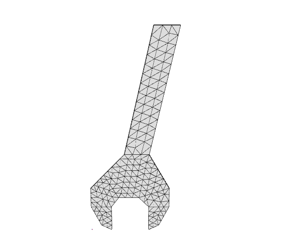

Surface
^^^^^^^

.. py:method:: Model.surface(split, element, args, points=None, name=None, **kwds)

        Create a surface mesh of elements in the current model.

        :param split: tuple of integers
            The number of elements in the local :math:`x` and :math:`y` directions.
        :param element: str
            The name of the element type to use.
        :param args: tuple or dict,
            The arguments to pass to the element constructor.
        :param points: list of tuples
            The coordinates of the points in the mesh.
        :param name: str
            The name of the mesh.
        :param kwds: dict
            The keyword arguments to pass to the element constructor.
        :param order: int
            The order of the elements to use.
        :param shape: str
            The shape of the elements to use. Can be "Q" for quadrilateral or "T" for triangular.
        :return: Surface

This method is analogous to the `Create_Block <https://fedeas.net/Functions/latest/Utilities/PreProcessing/Structure/Create_Block/>`__ utility of *FEDEASLab*.

Examples
--------

The following snippet is part of `this <https://gallery.stairlab.io/examples/planeblock/>`__ 
example on the STAIRLab gallery. It creates a :math:`8 \times 4` mesh of linear (``order = 1``)
quadrilateral elements.

.. code-block:: python

    import xara 
    model = xara.Model(ndm=2, ndf=2)
    mesh = model.surface((8, 4),
                  element="Quad",
                  args={"section": 1},
                  order=1,
                  points={
                    1: [  0.0,   0.0],
                    2: [   L,    0.0],
                    3: [   L,     d ],
                    4: [  0.0,    d ]
            })

For a more complex example, visit the `wrench <https://gallery.stairlab.io/examples/wrench/>`__ example on the STAIRLab gallery.

