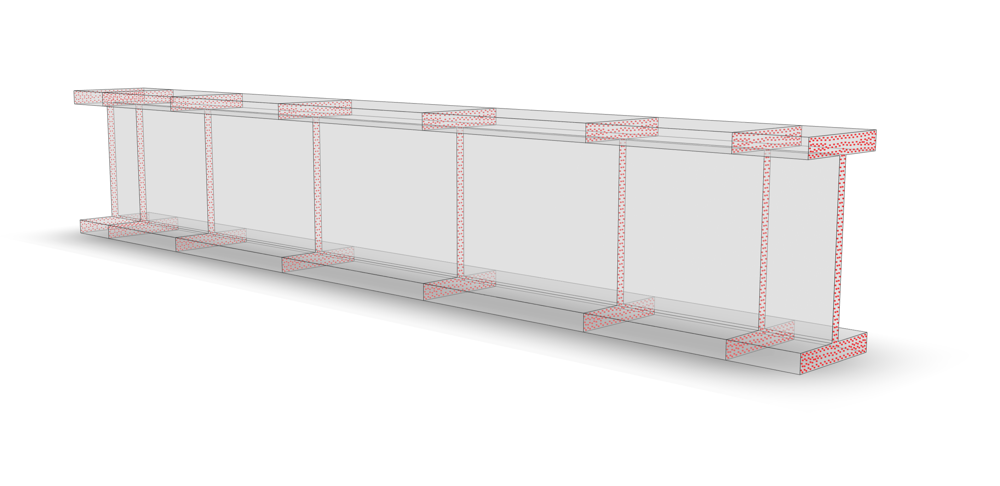

.. _ForceFrame:

``ForceFrame``
^^^^^^^^^^^^^^

	Fig. 1: Representation of the OpenSees *forceBeamColumn* element rendered with `veux <https://veux.io>`__.

Two-node force formulation for 3D frames. [1]_ [2]_.

.. tabs::

   .. tab:: Python (RT)

      .. py:method:: Model.element("MixedFrame", tag, nodes, section=None, transform=None, integration=None, *args)
         :no-index:

         :param tag: unique :ref:`element` tag
         :type tag: |integer|
         :param nodes: tuple of *two* :ref:`node` tags
         :type nodes: tuple
         :param section: integer tag identifying a :ref:`section`.
         :type section: |integer|
         :param transform: identifier for previously-defined :ref:`frame transformation <geomTransf>`
         :type transform: |integer|
         :param integration: identifier for previously-defined integration rule.

This formulation supports higher order strain measures and shear deformations.

The valid :ref:`eleResponse` queries to this element are ``"force"``.

References
----------

.. [1] Spacone, E., V. Ciampi, and F. C. Filippou (1996).  "Mixed Formulation of Nonlinear Beam Finite Element." Computers and Structures, 58(1):71-83.

.. [2] Lee, C.‐L., and F. C. Filippou. “Frame Elements with Mixed Formulation for Singular Section Response.” International Journal for Numerical Methods in Engineering 78, no. 11 (June 11, 2009): 1320–44. https://doi.org/10.1002/nme.2531.

Code developed by: |cmp|, |fcf|, |mhs|, |fmk|

