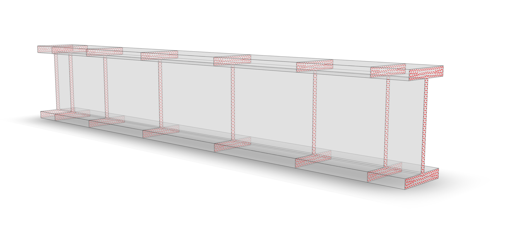

.. _ForceFrame:

ForceFrame
^^^^^^^^^^

	Fig. 1: Section discretization of the :ref:`ForceFrame` element. Rendered with `veux <https://veux.io>`__.

Two-node force formulation for 3D frames. [1]_ [2]_.

.. tabs::

   .. tab:: Python

      .. py:method:: Model.element("ForceFrame", tag, nodes, *, section, transform, **options)
         :no-index:

         :param tag: unique :ref:`element` tag
         :type tag: |integer|
         :param nodes: tuple of *two* :ref:`node` tags
         :type nodes: tuple
         :param section: Section object to be created at the element Gauss points. 
         :type section: :py:class:`xara.FrameSection`
         :param transform: identifier for previously-defined :ref:`frame transformation <geomTransf>`
         :type transform: |integer|
         :gparam Optional integration: identifier for previously-defined integration rule.

:ref:`ForceFrame` is an extended implementation of the OpenSees *forceBeamColumn* element, which is 
based on the formulations described by [1]_, [2]_, and [3]_. 
In a model with 7 degrees of freedom, the element incorporates nonuniform warping effects as described by [5]_.

Output
------

The valid :ref:`eleResponse` queries to this element are:

-  ``"force"``.

- ``"section"``: Make a query to a specific section along the element:

  .. code-block:: python

     model.eleResponse(element, "section", section, *section-args)

Examples 
--------

.. ref-gallery::

   examples/frames/frame-2007

References
----------

.. [1] Spacone, E., V. Ciampi, and F. C. Filippou (1996).  "Mixed Formulation of Nonlinear Beam Finite Element." Computers and Structures, 58(1):71-83.

.. [2] Lee, C.‐L., and F. C. Filippou. "Frame Elements with Mixed Formulation for Singular Section Response." International Journal for Numerical Methods in Engineering 78, no. 11 (June 11, 2009): 1320–44. https://doi.org/10.1002/nme.2531.

.. [3] R. L. Taylor, F. C. Filippou, A. Saritas, and F. Auricchio, "A mixed finite element method for beam and frame problems," Computational Mechanics, vol. 31, no. 1–2, pp. 192–203, May 2003, doi: `10.1007/s00466-003-0410-y <https://doi.org/10.1007/s00466-003-0410-y>`__.

.. [5] Perez, C. M. "Nonlinear Modeling of Frame Members for Rapid Infrastructure Assessment." Ph.D., University of California, Berkeley, 2026.

Code developed by: |cmp|, |fcf|, |mhs|, |fmk|

