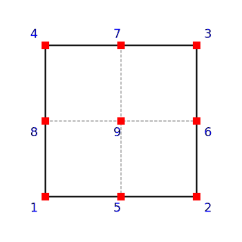

.. _quad:

BasicQuad
^^^^^^^^^

This command is used to construct a BasicQuad element which uses the standard Lagrange isoparametric formulation.

.. tabs::

   .. tab:: Python 

      .. py:method:: Model.element("Quad", tag, nodes, section, [pressure, rho, b1, b2])
         :no-index:

         :param tag: integer, unique :ref:`Element` tag
         :param nodes: tuple, a tuple of four element nodes in counter-clockwise order
         :param section: tuple or int. If int, it is the tag of a previously defined :ref:`PlaneStress` or :ref:`PlaneStrain` section. If tuple, it is a tuple of the form (``thick``, ``type``, ``material``) where 
           
             ===================================   ==============================================================================================================
             ``thick`` |float|                     element thickness
             ``type`` |str|                        string representing material behavior. The type parameter can be either ``"PlaneStrain"`` or ``"PlaneStress"``
             ``material`` |integer|                tag of an :ref:`nDMaterial`
             ===================================   ==============================================================================================================
           
         :param pressure: |float|, surface pressure (optional, default = 0.0)
         :param rho: |float|, element mass density (per unit volume) from which a lumped element mass matrix is computed (optional, default=0.0)
         :param b1: |float|, constant body forces defined in the domain (optional, default=0.0)
         :param b2: |float|, constant body forces defined in the domain (optional, default=0.0)

   .. tab:: Tcl

      .. function:: element quad $eleTag $iNode $jNode $kNode $lNode $thick $type $matTag <$pressure $rho $b1 $b2>

      .. csv-table:: 
         :header: "Argument", "Type", "Description"
         :widths: 10, 10, 40

         $eleTag, |integer|, unique :ref:`Element` tag
         $iNode $jNode $kNode $lNode, |integer|   four nodes defining element boundaries, input in counter-clockwise order around the element.
         $thick, |float|,  element thickness
         $type, |string|,  string representing material behavior. The type parameter can be either "PlaneStrain" or "PlaneStress."
         $matTag, |integer|, tag of nDMaterial
         $pressure, |float|, surface pressure (optional: default = 0.0)
         $rho, |float|,  element mass density (per unit volume) from which a lumped element mass matrix is computed (optional: default=0.0)
         $b1 $b2, |float|, constant body forces defined in the isoparametric domain (optional: default=0.0)

The valid :ref:`eleResponse` queries to this element are ``"forces"``, ``"stresses"``, and ``"material $matNum matArg1 matArg2 ..."`` where ``$matNum`` refers to the material object at the integration point corresponding to the node numbers in the isoparametric domain.

Consistent nodal loads are computed from the pressure and body forces.

   Quad element node numbering

Example
-------

The following example constructs a quad element for use in a plane stress problem with tag **1** between nodes **1, 2, 3, 4** with an nDMaterial of tag **1**.

1. **Tcl Code**

   .. code-block:: tcl

      element quad 1 1 2 3 4 "PlaneStress" 1 

2. **Python Code**

   .. code-block:: python

      model.element("quad", 1, (1,2,3,4), (1.0, "PlaneStress", 1), (b1, b2, b3))

Code Developed by: |mhs|

