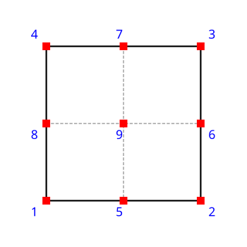

.. _quad:

Q4-Q9
^^^^^

A *Quad* element uses the standard Lagrange isoparametric formulation.

.. tabs::

   .. tab:: Python 

      .. py:method:: Model.element("Quad", tag, nodes, section, [pressure, rho, b1, b2])
         :no-index:

         Construct a *BasicQuad* and add it to the :class:`Model`.

         :param tag: unique :ref:`Element` tag
         :type tag: |integer|
         :param nodes: a tuple of four element nodes in counter-clockwise order. 
         :type nodes: tuple of four, eight or nine :ref:`Node` tags
         :param section: tuple or int. If int, it is the tag of a previously defined :py:class:`xara.PlaneSection`. If tuple, it is a tuple of the form (``thick``, ``type``, ``material``) where 
           
             ===================================   ==============================================================================================================
             ``thick`` |float|                     element thickness
             ``type`` |str|                        string representing material behavior. The type parameter can be either ``"PlaneStrain"`` or ``"PlaneStress"``
             ``material`` |integer|                tag of a :ref:`MultiaxialMaterial <nDMaterial>`
             ===================================   ==============================================================================================================
           
         :param pressure: surface pressure (optional, default = 0.0)
         :type pressure: |float|
         :param rho: element mass density (per unit volume) from which a lumped element mass matrix is computed (optional, default=0.0). See :ref:`MassSources` for more information.
         :type rho: |float|
         :param b1: constant body forces defined in the domain (optional, default=0.0)
         :type b1: |float|, optional
         :param b2: constant body forces defined in the domain (optional, default=0.0)
         :type b2: |float|, optional

   .. tab:: Tcl

      .. function:: element quad $eleTag $iNode $jNode $kNode $lNode $thick $type $matTag <$pressure $rho $b1 $b2>

      .. csv-table:: 
         :header: "Argument", "Type", "Description"
         :widths: 10, 10, 40

         $eleTag, |integer|, unique :ref:`Element` tag
         $iNode $jNode $kNode $lNode, |integer|   four nodes defining element boundaries, input in counter-clockwise order around the element.
         $thick, |float|,  element thickness
         $type, |string|,  string representing material behavior. The type parameter can be either "PlaneStrain" or "PlaneStress."
         $matTag, |integer|, tag of nDMaterial
         $pressure, |float|, surface pressure (optional: default = 0.0)
         $rho, |float|,  element mass density (per unit volume) from which a lumped element mass matrix is computed (optional: default=0.0)
         $b1 $b2, |float|, constant body forces defined in the isoparametric domain (optional: default=0.0)

   Quad element node numbering

Output
------

The valid :ref:`eleResponse` queries to this element are ``"forces"``, ``"stresses"``, and ``"material $matNum matArg1 matArg2 ..."`` where ``matNum`` refers to the material object at the integration point corresponding to the node numbers in the isoparametric domain.

Furthermore, stresses can be extrapolated from quadrature points to nodes using the ``"stressAtNodes"`` response. 
The stresses are computed at the four gauss points of the element and then extrapolated to the nodes using the inverse of 
the interpolation matrix. For a four-node quadrilateral this is given by:

.. math::

   \left[\begin{array}{cccc}
   1+\frac{1}{2} \sqrt{3} & -\frac{1}{2} & 1-\frac{1}{2} \sqrt{3} & -\frac{1}{2} \\
   -\frac{1}{2} & 1+\frac{1}{2} \sqrt{3} & -\frac{1}{2} & 1-\frac{1}{2} \sqrt{3} \\
   1-\frac{1}{2} \sqrt{3} & -\frac{1}{2} & 1+\frac{1}{2} \sqrt{3} & -\frac{1}{2} \\
   -\frac{1}{2} & 1-\frac{1}{2} \sqrt{3} & -\frac{1}{2} & 1+\frac{1}{2} \sqrt{3}
   \end{array}\right]

Examples
--------

.. ref-gallery::

   examples/plane/plane-0002

References
----------

Code Developed by: |mhs|

