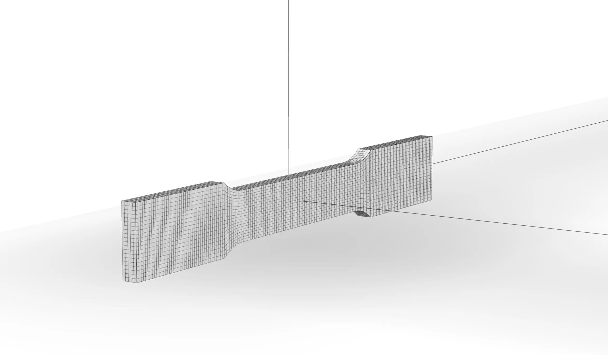

.. _stdBrick:

Brick
^^^^^

   Tension coupon modeled by 8-node brick elements

.. tabs::

   .. tab:: Python

      .. py:method:: Model.element("Brick", tag, nodes, material, *args, **kwargs)
         :no-index:

         Construct an eight-node brick using the standard isoparametric formulation.

         :param tag: integer tag identifying the element
         :param nodes: tuple of integer tags identifying the nodes that form the element
         :param material: integer tag identifying the nDMaterial
         :param args: optional arguments
         :param kwargs: optional keyword arguments

   .. tab:: Tcl

      .. function:: element Brick $tag {*}$nodes $matTag <$b1 $b2 $b3>

      .. csv-table:: 
         :header: "Argument", "Type", "Description"
         :widths: 10, 10, 40

         $tag, |integer|,	unique :ref:`Element` tag
         $nodes, 8 |integer|, nodes of brick (ordered as shown in fig below)
         $matTag, |integer|, tag of nDMaterial
         $b1 $b2 $b3, |listFloat|, optional: body forces in global x y z directions

.. figure:: H20.svg
	:align: center
	:figclass: align-center

	Brick element node numbering

.. note::

   This element can only be defined in a :class:`Model` with ``ndm=3`` and ``ndf=3``.

Recorders
---------

The valid queries to a Brick element when creating an ElementRecorder are 

#. ``"forces"``, 
#. ``"stresses,"``,
#. ``"strains"``,
#. ``"stressAtNodes"``, 
#. ``"material $mat args..."`` Where ``$mat`` refers to the material object at the integration point corresponding to the node numbers in the isoparametric domain.

Theory 
------

The standard 8-node isoparametric brick, or "hexahedron" element, is a three-dimensional solid element with trilinear Lagrange interpolation.
The element is described by Hughes (2000) in Section 3.5 and Zienkiewicz and Taylor (2013) in Section 6.3.2.3.

Example
-------

The following example constructs a brick element with tag **1** between nodes **1, 2, 3, 4, 5, 6, 7, 8** with an nDMaterial of tag **1** and body forces given by varaiables **b1, b2, b3**.

1. **Python Code**

   .. code-block:: Python

      model.element("Brick",1, (1,2,3,4,5,6,7,8), 1, (b1, b2, b3))

2. **Tcl Code**

   .. code-block:: tcl

      element Brick 1 1 2 3 4 5 6 7 8 1 $b1 $b2 $b3

References
----------

Code Developed by: **Edward Love, Sandia National Laboratories**

