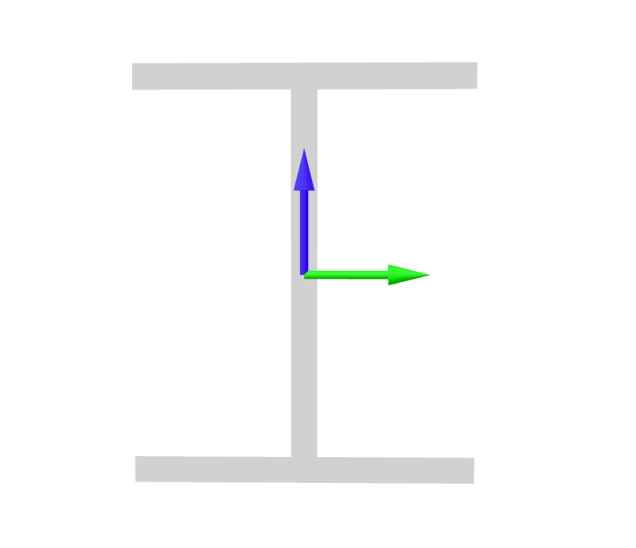

.. _ElasticFrame:

ElasticFrame
^^^^^^^^^^^^

The **ElasticFrame** section implements a general linear elastic :ref:`Frame <Frame>` cross-section.

   Local axes of a 3D cross section

.. tabs::

   .. tab:: Python (RT)

      .. py:method:: Model.section("ElasticFrame", tag, **kwds)
         :no-index:

         :param E: Young's modulus
         :param G: Shear modulus (see :ref:`ElasticIsotropic`)
         :param A: cross sectional area
         :param Iy: Moment of inertia about the :math:`\color{green}{y}` axis
         :param Iz: Moment of inertia about the :math:`\color{blue}{z}` axis
         :param J: Torsion constant
         :param kwds: additional keyword arguments

   .. tab:: Tcl

      .. function:: section ElasticFrame $tag $E $A $Iz $Iy $G $J

      The required arguments are:

      .. csv-table:: 
         :header: "Argument", "Type", "Description"
         :widths: 10, 10, 40

         $tag, |integer|,	  unique section tag

The valid :ref:`eleResponse` queries are 

* ``"force"``, and 
* ``"deformation"``. 

.. note::

   This section is appropriate for *any* homogeneous section. It is capable of
   representing asymmetric sections, shear warping and torsional warping.

Formulation
-----------

Examples
--------

The following is an excerpt from a Python script that creates a 3D model with an elastic frame section:

.. code-block:: Python

   model.section("ElasticFrame", 1,
                 E=29e3*ksi,
                 G=11.2e3*ksi,
                 A=A,
                 Iy=Iy,
                 Iz=Iz,
                 J=J
   )

The following syntax is supported in 2D models for backwards compatibility:

.. tabs::

   .. tab:: Python

      .. code-block:: Python
         
         model.section("ElasticFrame", 1, E, A, I)

References
----------

