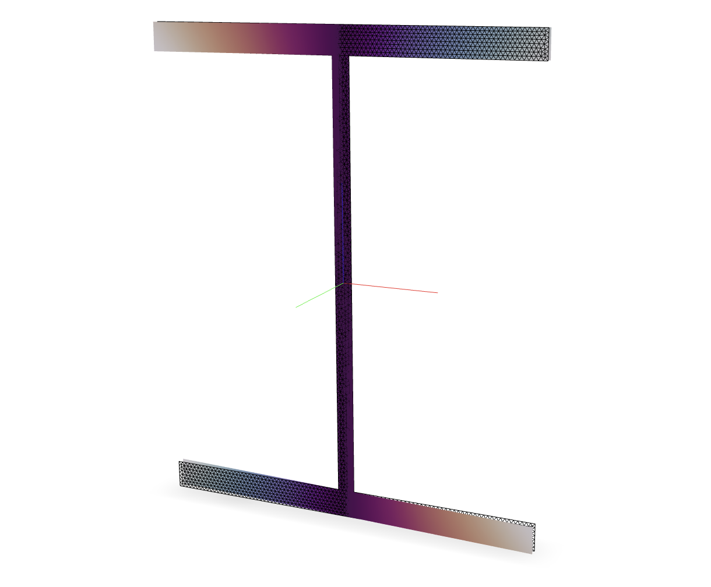

.. _ShearFiber:

ShearFiber
^^^^^^^^^^

A ``ShearFiber`` section is used to model a :ref:`Frame <frame>` section with shear deformation. 
The section is defined by a collection of fibers that discretize the cross-section. 

.. tabs::

   .. tab:: Python (RT)
    
      .. py:method:: Model.section("ShearFiber", tag, **kwds)
         :no-index:
         
         :param tag: unique :ref:`section` tag
         :type tag: |integer|

   .. tab:: Tcl

      .. function:: section ShearFiber $tag $fibers
         
         :param tag: unique section tag

   Example of an AISC *W8x28* section discretized with fibers and rendered with `veux <https://veux.io>`__.

The ``fiber`` method is used to populate the section with fibers. The required arguments are:

.. tabs::

   .. tab:: Python
    
      .. py:method:: Model.fiber((y, z), A, tag, warp, section)

         :param y: :math:`y`-coordinate of the fiber
         :type y: float
         :param z: :math:`z`-coordinate of the fiber
         :type z: float
         :param A: area of the fiber
         :type A: float
         :param material: tag of a preexisting material created with the :ref:`material` method.
         :type material: |integer|
         :param warp: tuple of up to three warping modes. A warping mode is a list of three floats. The first float is the amplitude of the mode, and the second and third floats are derivatives with respect to the :math:`y` and :math:`z` coordinates, respectively.
         :type warp: tuple
         :param section: tag of the section to which the fiber belongs. This argument must be passed by keyword.
         :type section: |integer|

In general, the ``warp`` modes are scaled by independent amplitude fields which introduce additional degrees of freedom.
When no additional degrees of freedom are provided by the model, elements in the :ref:`Frame <Frame>` library will constrain these fields to match an appropriate strain field.

The valid :ref:`eleResponse` queries are 

* ``"force"``, and 
* ``"deformation"``. 

Valid :ref:`setParameter` targets are

- ``"warp", fiber, field`` where ``fiber`` is an |integer| identifying a fiber and ``field`` is an |integer| identifying the warping field.

Examples 
--------

The following example demonstrates how to create a ``ShearFiber`` section representing a circle.

.. tabs::

   .. tab:: Python

      .. code-block:: Python 

         import xara
         from math import pi
         radius = 0.5
         center = (0.0, 0.0)
         area   = pi * radius**2

         model = xara.Model(ndm=3, ndf=6)

         model.material("ElasticIsotropic", 1, E=200e9, nu=0.3)

         model.section("ShearFiber", 1)
         model.fiber(center, area, material=1, section=1)

   .. tab:: Tcl

      .. code-block:: Tcl

         set radius 0.5
         set center 0.0 0.0
         set area   [expr {pi * $radius**2}]

         model create -ndm 3 -ndf 6

         model material ElasticIsotropic 1 E 200e9 nu 0.3

         model section ShearFiber 1
         model fiber $center $area material 1 section 1

The following example uses the ``xsection`` library to create a ``ShearFiber`` section representing an AISC *W8x28* section.

.. code-block:: Python

   import xara
   from xsection.library import from_aisc

   model = xara.Model(ndm=3, ndf=6)

   model.material("ElasticIsotropic", 1, E=200e9, nu=0.3)

   shape = from_aisc("W8x28", units)

   model.section("ShearFiber", 1)
   for fiber in shape.fibers:
       model.fiber(**fiber, material=1, section=1)
