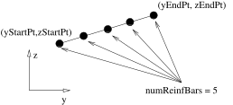

# layer


```{eval-rst}
.. py:method:: Model.layer("circ", material, divs, area, center, radius, arc, **kwds)

   :param int material: material tag of a previously created UniaxialMaterial
   :param int divs: number of fibers to generate
```


<table>
<colgroup>
  <col style="width: 10%" ><col style="width: 30%" ><col style="width: 60%" >
</colgroup>
<tbody>

<tr><td>material</td><td><code>Ref(Material)</code></td><td>material tag of previously created material (UniaxialMaterial tag for a FiberSection or NDMaterial tag for use in an NDFiberSection)</tr>
<tr><td>divs</td><td><code>Int</code></td><td>number of fibers along arc</tr>
<tr><td>area</td><td><code>Num</code></td><td>area of each fiber</tr>
<tr><td>center</td><td><code>[y,z]</code></td><td>$y$ and $z$-coordinates of center of circular arc<table>
<tr><td>y</td><td><code>Num</code></td><td></tr>
<tr><td>z</td><td><code>Num</code></td><td></tr>
</table>
</tr>
<tr><td>radius</td><td><code>Num</code></td><td>radius of circular arc</tr>
<tr><td>arc = [0.0, 6.283185307179586]</td><td><code>[startAng,endAng]</code></td><td><table>
<tr><td>startAng</td><td><code>Num</code></td><td>starting angle</tr>
<tr><td>endAng</td><td><code>Num</code></td><td>ending angle</tr>
</table>
</tr>

</tbody>
</table>


```{eval-rst}
.. py:method:: Model.layer("line", material, divs, area, vertices)
   :no-index:
```




<table>
<colgroup>
  <col style="width: 10%" ><col style="width: 30%" ><col style="width: 60%" >
</colgroup>
<tbody>

<tr><td>material</td><td><code>Ref(Material)</code></td><td>Reference to previously created material                  (`UniaxialMaterial` for a `FiberSection` or `NDMaterial`                  for use in an `NDFiberSection`)</tr>
<tr><td>divs</td><td><code>Int</code></td><td>number of fibers along line</tr>
<tr><td>area</td><td><code>Num</code></td><td>area of each fiber</tr>
<tr><td>vertices</td><td><code>[[x,y],[x,y]]</code></td><td><table>
<tr><td>start</td><td><code>[x,y]</code></td><td>$x$ and $y$-coordinates of first fiber                        in line (local coordinate system)<table>
<tr><td>x</td><td><code>Num</code></td><td></tr>
<tr><td>y</td><td><code>Num</code></td><td></tr>
</table>
</tr>
<tr><td>end</td><td><code>[x,y]</code></td><td>$x$ and $y$-coordinates of last fiber in line (local coordinate system)<table>
<tr><td>x</td><td><code>Num</code></td><td></tr>
<tr><td>y</td><td><code>Num</code></td><td></tr>
</table>
</tr>
</table>
</tr>
</tbody>
</table>
