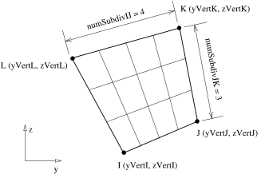
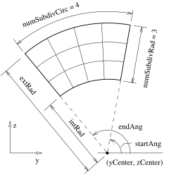
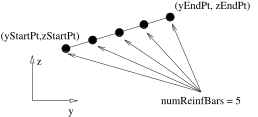

---
title: patch
...

<style>
h1 {
    font-family: var(--md-code-font-family);
    color: var(--md-code-fg-color) !important;
    font-feature-settings: "kern";
}
</style>

# patch

A patch is used to generate a number of fibers over a cross-sectional area. 
Currently there are three types of patches that fibers can be generated over: 
quadrilateral, rectangular and circular.


```{eval-rst}
.. py:method:: Model.patch("rect", material, divs, corners)
   :no-index:

```

<table>
<colgroup>
  <col style="width: 10%" ><col style="width: 30%" ><col style="width: 60%" >
</colgroup>
<tbody>

<tr><td>material</td><td><code>Ref(Material)</code></td><td>tag of previously defined material (`UniaxialMaterial`tag for a `FiberSection` or `NDMaterial` tag for use in an `NDFiberSection`)</tr>
<tr><td>divs</td><td><code>[ij,jk]</code></td><td><table>
<tr><td>ij</td><td><code>Int</code></td><td>number of subdivisions (fibers) in the IJ direction.</tr>
<tr><td>jk</td><td><code>Int</code></td><td>number of subdivisions (fibers) in the JK direction.</tr>
</table>
</tr>
<tr><td>corners</td><td><code>[[yI,zI],[yK,zK]]</code></td><td><table>
<tr><td><code>[yI,zI]</code></td><td><code>Grp</code></td><td>$y$ & $z$-coordinates of vertex I (local coordinate system)<table>
<tr><td>yI</td><td><code>Num</code></td><td></tr>
<tr><td>zI</td><td><code>Num</code></td><td></tr>
</table>
</tr>
<tr><td><code>[yK,zK]</code></td><td><code>Grp</code></td><td>$y$ & $z$-coordinates of vertex K (local coordinate system)<table>
<tr><td>yK</td><td><code>Num</code></td><td></tr>
<tr><td>zK</td><td><code>Num</code></td><td></tr>
</table>
</tr>
</table>
</tr>

</tbody>
</table>
<!-- </blockquote> -->


<!-- <blockquote> -->
<span style="font-feature-settings: kern; color: var(--md-code-fg-color) !important; font-family: var(--md-code-font-family);">
    <span style="color:#900">quad</span>(material, divs, vertices, **kwds)
</span>




<table>
<colgroup>
  <col style="width: 10%" ><col style="width: 30%" ><col style="width: 60%" >
</colgroup>
<tbody>

<tr><td>material</td><td><code>Ref(Material)</code></td><td>tag of previously defined material (`UniaxialMaterial` tag for a `FiberSection` or `NDMaterial` tag for use in an `NDFiberSection`)</tr>
<tr><td>divs</td><td><code>[ij,jk]</code></td><td><table>
<tr><td>ij</td><td><code>Int</code></td><td>number of subdivisions (fibers) in the IJ direction.</tr>
<tr><td>jk</td><td><code>Int</code></td><td>number of subdivisions (fibers) in the JK direction.</tr>
</table>
</tr>
<tr><td>vertices</td><td><code>[[x,y],[x,y],[x,y],[x,y]]</code></td><td><table>
<tr><td>i</td><td><code>[x,y]</code></td><td>$x$ & $y$-coordinates of vertex I (local coordinate system)<table>
<tr><td>x</td><td><code>Num</code></td><td></tr>
<tr><td>y</td><td><code>Num</code></td><td></tr>
</table>
</tr>
<tr><td>j</td><td><code>[x,y]</code></td><td>$x$ & $y$-coordinates of vertex J (local coordinate system)<table>
<tr><td>x</td><td><code>Num</code></td><td></tr>
<tr><td>y</td><td><code>Num</code></td><td></tr>
</table>
</tr>
<tr><td>k</td><td><code>[x,y]</code></td><td>$x$ & $y$-coordinates of vertex K (local coordinate system)<table>
<tr><td>x</td><td><code>Num</code></td><td></tr>
<tr><td>y</td><td><code>Num</code></td><td></tr>
</table>
</tr>
<tr><td>l</td><td><code>[x,y]</code></td><td>$x$ & $y$-coordinates of vertex L (local coordinate system)<table>
<tr><td>x</td><td><code>Num</code></td><td></tr>
<tr><td>y</td><td><code>Num</code></td><td></tr>
</table>
</tr>
</table>
</tr>

</tbody>
</table>
<!-- </blockquote> -->


```{eval-rst}
.. py:method:: Model.patch("circ", material, divs, center, radius [, extrad])
   :no-index:

```

<span style="font-feature-settings: kern; color: var(--md-code-fg-color) !important; font-family: var(--md-code-font-family);">
    <span style="color:#900">circ</span>(material,<br>&emsp;&emsp;&emsp;divs,<br>&emsp;&emsp;&emsp;center,<br>&emsp;&emsp;&emsp;intRad,<br>&emsp;&emsp;&emsp;extRad,<br>&emsp;&emsp;&emsp;startAng,<br>&emsp;&emsp;&emsp;endAng,<br>&emsp;&emsp;&emsp;**kwds)
</span>




<table>
<colgroup>
  <col style="width: 10%" ><col style="width: 30%" ><col style="width: 60%" >
</colgroup>
<tbody>

<tr><td>material</td><td><code>Ref(Material)</code></td><td>tag of previously defined material (`UniaxialMaterial` tag for a `FiberSection` or `NDMaterial` tag for use in an `NDFiberSection`)</tr>
<tr><td>divs</td><td><code>[circ,rad]</code></td><td><table>
<tr><td>circ</td><td><code>Int</code></td><td>number of subdivisions (fibers) in the circumferential direction (number of wedges)</tr>
<tr><td>rad</td><td><code>Int</code></td><td>number of subdivisions (fibers) in the radial direction (number of rings)</tr>
</table>
</tr>
<tr><td>center = [0.0, 0.0]</td><td><code>[y,z]</code></td><td>$y$ & $z$-coordinates of the center of the circle<table>
<tr><td>y</td><td><code>Num</code></td><td></tr>
<tr><td>z</td><td><code>Num</code></td><td></tr>
</table>
</tr>
<tr><td>intRad</td><td><code>Num</code></td><td>internal radius</tr>
<tr><td>extRad</td><td><code>Num</code></td><td>external radius</tr>
<tr><td>startAng</td><td><code>Num</code></td><td>starting angle</tr>
<tr><td>endAng = 6.283185307179586</td><td><code>Num</code></td><td>ending angle</tr>

</tbody>
</table>


```{eval-rst}
.. py:method:: Model.layer("line", ...)
   :no-index:

```
<span style="font-feature-settings: kern; color: var(--md-code-fg-color) !important; font-family: var(--md-code-font-family);">
    <span style="color:#900">line</span>(material, divs, fiber_area, vertices, **kwds)
</span>




<table>
<colgroup>
  <col style="width: 10%" ><col style="width: 30%" ><col style="width: 60%" >
</colgroup>
<tbody>

<tr><td>material</td><td><code>Ref(Material)</code></td><td>Reference to previously created material                  (`UniaxialMaterial` for a `FiberSection` or `NDMaterial`                  for use in an `NDFiberSection`)</tr>
<tr><td>divs</td><td><code>Int</code></td><td>number of fibers along line</tr>
<tr><td>area</td><td><code>Num</code></td><td>area of each fiber</tr>
<tr><td>vertices</td><td><code>[[x,y],[x,y]]</code></td><td><table>
<tr><td>start</td><td><code>[x,y]</code></td><td>$x$ and $y$-coordinates of first fiber                        in line (local coordinate system)<table>
<tr><td>x</td><td><code>Num</code></td><td></tr>
<tr><td>y</td><td><code>Num</code></td><td></tr>
</table>
</tr>
<tr><td>end</td><td><code>[x,y]</code></td><td>$x$ and $y$-coordinates of last fiber in line (local coordinate system)<table>
<tr><td>x</td><td><code>Num</code></td><td></tr>
<tr><td>y</td><td><code>Num</code></td><td></tr>
</table>
</tr>
</table>
</tr>

</tbody>
</table>

