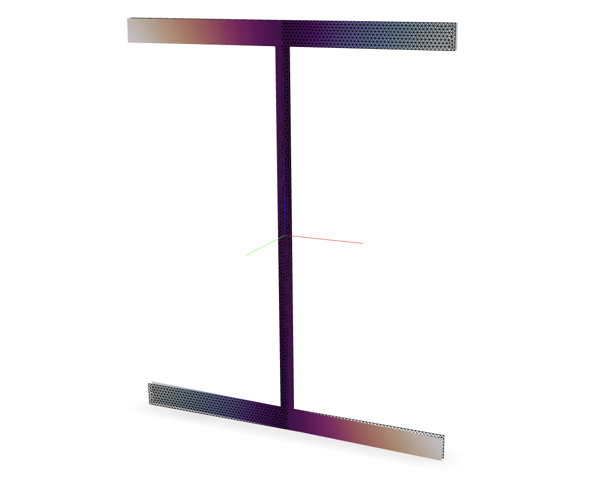

.. _MultiaxialFiber:

MultiaxialFiber
^^^^^^^^^^^^^^^

A ``MultiaxialFiber`` section is used to model a :ref:`Frame <frame>` section with shear deformation. 
The section is defined by a collection of fibers that discretize the cross-section. 

.. tabs::

   .. tab:: Class

      .. py:class:: xara.FrameSection("MultiaxialFiber", shape, *, fibers)
         :noindex:
         
         Create a frame section that integrates the response of :py:class:`xara.UniaxialMaterial` objects distributed over the section shape.

   .. tab:: OpenSeesPy
    
      .. py:method:: Model.section("MultiaxialFiber", tag, **kwds)
         :no-index:
         
         :param tag: unique :ref:`section` tag
         :type tag: |integer|

   .. tab:: Tcl

      .. function:: section MultiaxialFiber $tag $fibers
         
         :param tag: unique section tag

   Example of an AISC *W8x28* section discretized with fibers and rendered with `veux <https://veux.io>`__.

The valid :ref:`eleResponse` queries are 

* ``"force"``, and 
* ``"deformation"``. 

Valid :ref:`setParameter` targets are

- ``"warp", fiber, field`` where ``fiber`` is an |integer| identifying a fiber and ``field`` is an |integer| identifying the warping field.

Examples 
--------

.. ref-gallery::
    :tooltip:

    examples/sections/fiber-0002

.. The following example demonstrates how to create a ``MultiaxialFiber`` section representing a circle.

.. .. tabs::

..    .. tab:: Python

..       .. code-block:: Python 

..          import xara
..          from math import pi
..          radius = 0.5
..          center = (0.0, 0.0)
..          area   = pi * radius**2

..          model = xara.Model(ndm=3, ndf=6)

..          model.material("ElasticIsotropic", 1, E=200e9, nu=0.3)

..          model.section("MultiaxialFiber", 1)
..          model.fiber(center, area, material=1, section=1)

..    .. tab:: Tcl

..       .. code-block:: Tcl

..          set radius 0.5
..          set center 0.0 0.0
..          set area   [expr {acos(-1) * $radius**2}]

..          model create -ndm 3 -ndf 6

..          nDMaterial ElasticIsotropic 1  200e9 0.3

..          section ShearFiber 1 {
..            fiber $center $area -material 1
..          }

.. The following example uses the ``xsection`` library to create a ``MultiaxialFiber`` section representing an AISC *W8x28* section.

.. .. code-block:: Python

..    import xara
..    from xara.units import english
..    from xsection.library import from_aisc

..    model = xara.Model(ndm=3, ndf=6)

..    model.material("ElasticIsotropic", 1, E=200e9, nu=0.3)

..    shape = from_aisc("W8x28", units=english)

..    model.section("ShearFiber", 1)
..    for fiber in shape.fibers:
..        model.fiber(**fiber, material=1, section=1)

