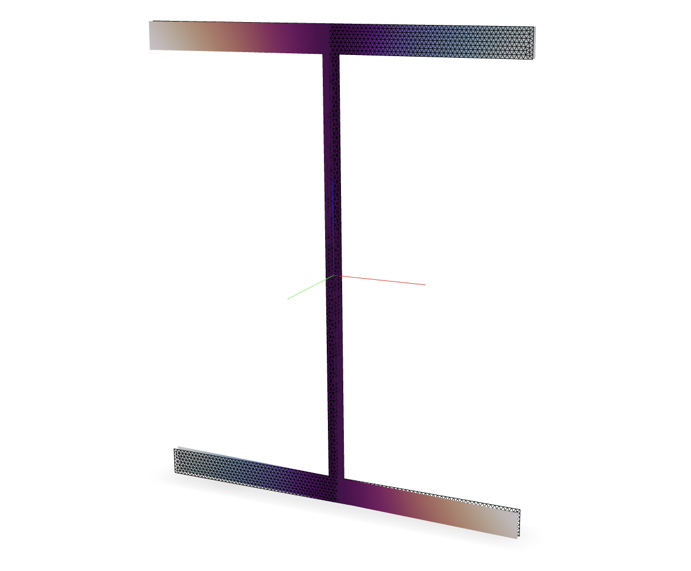

.. _MultiaxialFiber:

MultiaxialFiber
^^^^^^^^^^^^^^^

A ``MultiaxialFiber`` section is used to model a :ref:`Frame <frame>` section with shear deformation. 
The section is defined by a collection of fibers that discretize the cross-section. 

.. tabs::

   .. tab:: Class

      .. py:class:: xara.FrameSection("MultiaxialFiber", shape, *, fibers)
         :noindex:
         
         Create a frame section that integrates the response of :py:class:`xara.MultiaxialMaterial` objects distributed over the section shape.

         :param shape: A :ref:`Shape <FrameShape>` object defining the cross-sectional geometry.
         :param fibers: An *optional* dictionary describing the distribution of fibers over the cross-section. By default fibers will be generated automatically.
         :type fibers: dict, optional

   .. tab:: OpenSeesPy
    
      .. py:method:: Model.section("MultiaxialFiber", tag, **kwds)
         :no-index:
         
         :param tag: unique :ref:`section` tag
         :type tag: |integer|

   .. tab:: Tcl

      .. function:: section MultiaxialFiber $tag $fibers
         
         :param tag: unique section tag

   Example of an AISC *W8x28* section discretized with fibers and rendered with `veux <https://veux.io>`__.

Valid :ref:`setParameter` targets are

- ``"warp", fiber, field`` where ``fiber`` is an |integer| identifying a fiber and ``field`` is an |integer| identifying the warping field.

Examples 
--------

.. ref-gallery::
    :tooltip:

    examples/sections/fiber-000
    examples/frames/frame-2007
