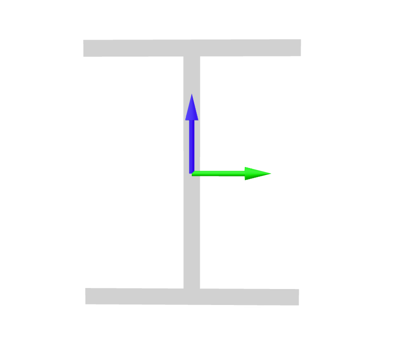

.. _ElasticSection:

Elastic
^^^^^^^

The **ElasticFrame** section implements a general linear elastic :ref:`Frame <Frame>` cross-section.

   Local axes of a 3D cross section

.. py:class:: xara.FrameSection("Elastic", shape)
   :noindex:

   :param E,G: Young's modulus :math:`E` and shear modulus :math:`G` (see :ref:`ElasticIsotropic`) [1]_
   :param A: cross sectional area (Units of Length:sup:`2`) [1]_
   :param Iy: Moment of inertia about the :math:`\color{green}{y}` axis [1]_
   :param Iz: Moment of inertia about the :math:`\color{blue}{z}` axis [1]_
   :param J: Torsion constant
   :param kwds: additional keyword arguments

